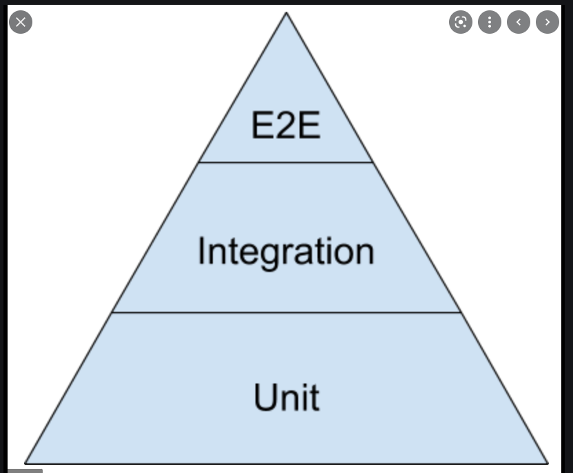

# 테스트란

제품이 우리가 원하는대로 예상하는 대로 동작하는지 확인

제품 = 함수,특정한기능, UI,성능, API스펙등....

어떤제품에 어떤환경에 따라 테스트가 다름 -> 다양한 테스트가 존재함

# 언제 테스트함?

## 옛날 방식
개발자가 개발 -> QA가 테스트(손으로 버튼 하나하나 눌러봄) -> 출시
- 단점 : 하나하나 눌러보니깐 시간,비용이 증가됨

## 요즘
개발하면서 테스트 -> QA -> 출시
- 장점 : 속도가 빨라짐, 쉽게 작성, 높은 커버리지

# 테스트의 장점
- 기능정상동작 확인
- 요구사항을 확실히 이해하기 때문에 요구 사항 만족이 높아짐
- 이슈에 대해 예측
- 버그를 빠르게 발견
- 자신감있게 리팩토링
- 손쉬운 유지보수
- 코드의 품질 향상
- 코드간 의존성을 낮춤
- 좋은 문서화 

# 테스트 피라미드

## Unit Test(단위 테스트)
- 독립적인 함수, 모듈, 클래스등 딱 하나의 단위를 테스트 한다.

ex) 자동차의 바퀴 하나

## Integration Test(통합 테스트)
- 여러가지의 단위 통합했을때 상호작용을 테스트함

ex) 자동차 바퀴 4개 연결해서 엔진이 돌아갈떄 바퀴돌아가는거

## E2E Test(end-To-end Test)
- 사용자테스트, UI테스트
- 사용자가 실제로 사용할때의 Flow를 테스트함

ex) 운전자가 운전할는것을 테스트

## 비용적인 측면

단위 < 통합 < E2E

## 속조적인 측면

단위 < 통합 < E2E

단위테스트가 더 쉽고 , 빠르고, 수정하기도 쉽고 -> 그래서 단위테스트를 먼저 확실히 해야함.

그외에도
A/B, Stress, Contract Test등 상황에 따라 다양한 테스트 방법이 존재함

