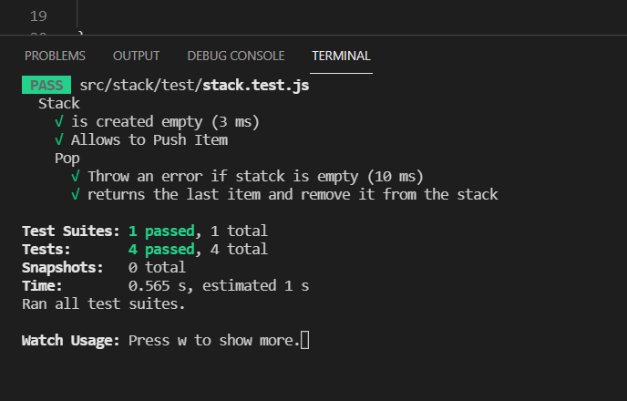

# TDD(Test-driven development) 테스트 주도 개발

개발(코드 작성)전 테스트 코드를 먼저 작성

# TDD구현 

테스트 코드 작성 -> 

테스트(실패) ->

테스트 통과할정도로 작게 다시 작성 -> 

테스트(성공) -> 

다음 테스트 코드 작성 ->

테스트(실패) ->

테스트 통과할정도로 작게 다시 작성 -> 

테스트(성공) -> ....

....

전체적인 코드 작성(구현) ->

리팩토링(소스정리) : 이미 테스트를 했기 때문에 자신감 있게 리팩토링 가능

# TDD장점

요구사항 분석및 설계 -> 설계 -> TDD

- 테스트를 먼저 작성하기 위해 -> 요구 사항 분석 및 이해가 필요함
- 요구 사항 분석 및 이해하고 그것을 설계하는 측면에서 테스트 코드 작성

-> 코드를 개발하기 앞서서 **모든 요구사항에 대해 점검**
-> 사용자 입장에서 코드를 작성(여기서 사용자는 나,다른 개발자) : 이 말은 내부 구현사항보다는 인터페이스 위주로 코드를 작성하기 떄문에 의존성 낮은 코드가 작성되고 코드의 퀄리티가 향상됨
-> 설계 향상
 

# TDD가 필요함?

TDD를 하던말든 이것은 개인의 자유이지만..

소스를 수정하고 메인에 올릴때는 항상 테스트를하고 테스트 코드를 같이 올려야함

그리고 테스트코드는 좋은 문서가 될수 있음

### 좋은 문서

이거 항상 옜날부터 무슨 소리인가 했다.

난 최종감리받을때 제출하는 단위테스트 문서를 Junit이 대신 만들어 주는줄 알았다.

그게 아니고

기능을 구현하고 코드만 읽는거보다는 해당하는 테스트코드를 함께 첨부하면

해당 코드를 사용하는방법, 돌아가는것을 이해할 수 있음 -> 그래서 문서화라고..

이 stack은

처음에 생성될때는 empty여야 하고
Push가 있어야하고
스택이 비어있을때는 pop을 하면 에러이고
마지막 아이템을 리턴하고 배열에서 제거해야하는구나?  -> 이렇게 알 수 있다는거

TDD를 할때도 있고 안할때도 있다 그러나 코드를 수정하고 배포하기전에는 

항상 **테스트코드**를 작성 해야만 함 -> 다른 사용자를 위해

### TDD 작성한는 경우
- 요구사항이 명확할때
- 비지니스 로직일경우
- 협업시 명세서(문서화) 역할
- 설계에 대한 고민이 필요할떄

UI할떄는 보통 안한다고 함.

# CI/CD에서의 테스트

### CI(지속적인 통합)

CI/CD는 모든 코드에 대한 테스트코드가 있다고 가정하고

1. 코드 변경사항을 주기적으로 빈번하게 머지 해야 한다.
2. 통합을 위한 단계(빌드,테스트,머지)의 자동화

-> 코드의 퀄리티 향상
-> 개발 생산성 향상
-> 버그 수정 용이
-> 문제점을 빠르게 발견

개발자가 코드를 머지하는 순간 내가 올린 코드뿐만아니라 기존의 모든 테스트를 자동적으로 진행함 -> 그래야 지속적인 배포(CD)도 가능한겨

